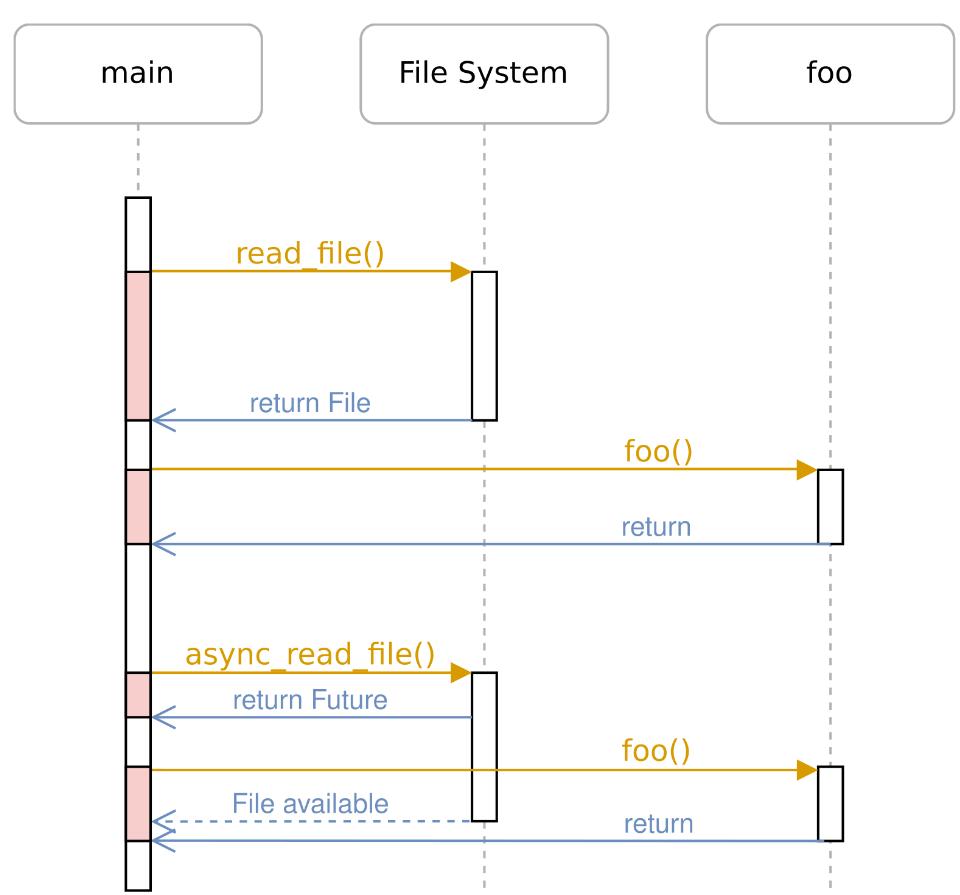
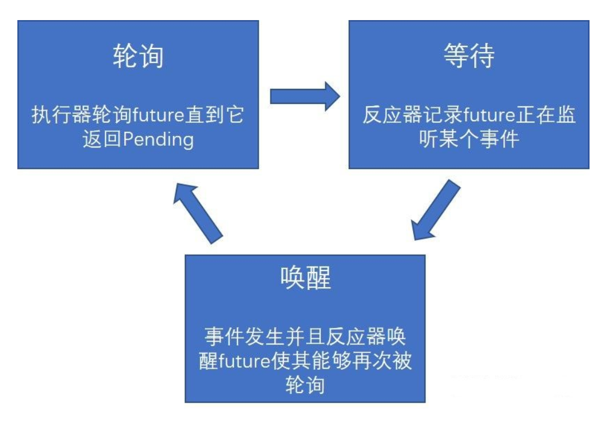
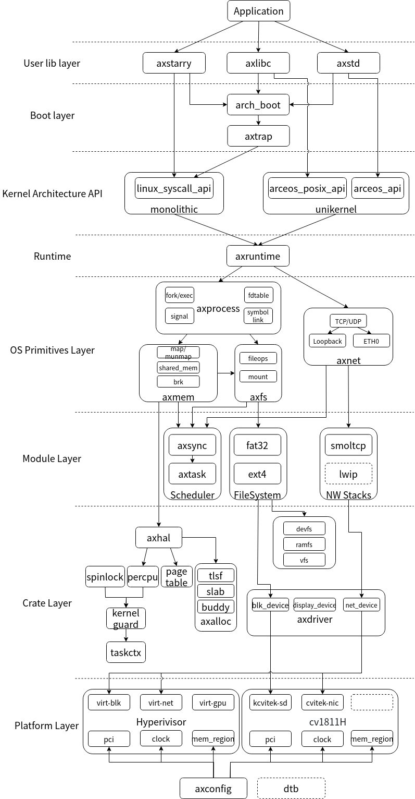

# 全国大学生系统能力大赛组会

## 议程

1. 比赛项目介绍
2. 项目进展汇报
3. 能力掌握考察
4. 今后工作安排
5. 论文发表计划

## 比赛项目介绍

### 操作系统赛道项目：基于Rust语言协程异步机制与RISC-V用户态中断拓展的模块化操作系统设计

#### Rust编程语言特性

- 静态类型系统：Rust的静态类型系统：类型推导、类型系统、模式匹配
- 内存安全：Rust的内存安全保证：类型系统、借用检查器、生命周期分析
- 并发安全：Rust的并发安全保证：原子性、可变性、同步、消息传递
- 零成本抽象：Rust的零成本抽象：Traits、生命周期、迭代器、闭包
- 高效的编译器：Rust的编译器优化：类型推导、借用检查、循环优化、内联
- 丰富的生态系统：Rust的生态系统：crates、crates.io、cargo、rustfmt、rustdoc、rust analyzer、rustfmt、clippy、rust-analyzer
- 跨平台跨架构：支持多种平台、多种架构、无缝集成

#### 协程异步机制

- Rust的异步框架：[tokio](https://tokio.rs/)、[async-std](https://docs.rs/async-std/latest/async_std/)、[futures](https://docs.rs/futures/latest/futures/)

- 异步机制：Green Thread、Coroutine、Event Loop

- 操作系统的基本概念：进程、线程、调度、同步、异步
- 基于协程的异步机制：基于回调的异步编程模型、基于消息的异步编程模型
- 系统模块的设计原则：可靠性、可扩展性、可维护性、可移植性
- 协程异步机制的实现：基于事件驱动、基于回调函数、基于消息队列
- 协程异步机制的优势：低开销，高性能，高并发
- 操作系统的改进方向：
1. 共享内存的进程调度器
2. 基于消息队列的异步进程通信模型
3. 基于事件驱动的异步文件系统与硬件驱动
4. 基于事件驱动的异步网络协议栈
- 常用异步驱动框架：[embassy](https://embassy.dev/)
- 经典教程
1. [200行代码讲透Rust Futures](https://stevenbai.top/rust/futures_explained_in_200_lines_of_rust/)
2. [Tokio 入门教程](https://tokio.rs/tokio/tutorial)
3. [操作系统专题训练课](https://www.xuetangx.com/course/THU0809100czxt/14294493?channel=i.area.learn_title)

#### RISC-V用户态中断拓展

- RISC-V指令集架构：RV32I、RV64I、RV128I
- RISC-V用户态中断机制：Supervisor Mode、User Mode、Interrupt、Exception
- RISC-V用户态中断拓展：支持系统调用、支持异步IO、支持定时器、支持信号量、支持线程
- 常用用户态中断处理框架：[ucontext](https://github.com/dovahcrow/ucontext-rs)、[redox-syscall](https://github.com/redox-os/syscall)
- 经典教程
1. [RISC-V 指令集架构](http://riscvbook.com/chinese/RISC-V-Reader-Chinese-v2p1.pdf)
2. [RISC-V 用户态中断机制](https://gallium70.github.io/rv-n-ext-impl/ch2_2_user_trap_handle_flow.html)
- 用户态中断实现：[U-interrupt](https://www.yuque.com/xyong-9fuoz/hg8kgr/nlr21043ghhmmuf9#gXRW2)
- 用户态中断实现属于硬件层，操作系统中内置用户态中断，其作用是将SoC平台的此特征物尽其用，可结合SoC硬件平台齐头共进。
- 操作系统的改进方向：
1. 基于用户态中断的事件处理模式，可结合协程异步机制
2. 基于用户态中断与消息传递的用户态系统管理模块

#### 模块化操作系统设计

- 模块化设计：模块化设计的优势：可靠性、可扩展性、可维护性、可移植性
- 模块化设计的原则：分离关注点、隔离变化、抽象化
- 模块化设计的实现：基于消息的通信机制、基于事件驱动的异步机制、基于系统调用的系统服务
- 模块化设计的应用：文件系统、网络协议栈、驱动程序、系统服务、用户态应用
- 经典教程
1. [模块化设计](https://www.cnblogs.com/liu-yao/p/11249292.html)
2. [模块化设计原则](https://www.cnblogs.com/liu-yao/p/11249292.html)
3. [模块化设计实现](https://www.cnblogs.com/liu-yao/p/11249292.html)
- 模块化操作系统：[Starry-OS](https://github.com/Starry-OS/Starry)

#### 现有进展

- 项目地址：[AsyncStarry](https://github.com/xforcevesa/AsyncStarry)
- 支持Linux系统的中断处理，及其基于系统调用的系统服务
- 实现了与libc基本兼容的C/Rust等语言运行环境，支持自编程程序。
- 可通过各类测试用例，支持Lua、UnixBench、BusyBox、C Shell等常见应用

### 龙芯杯赛道项目：基于Verilator与NEMU的LoongArch 32 Reduced架构敏捷开发SoC平台设计

#### Verilator仿真工具

- Verilator是一款开源仿真工具，支持多种硬件平台，包括Verilog、SystemVerilog、C++、SystemC、Verilog-A、VHDL等。
- Verilator支持多种编译器，包括GCC、Clang、MSVC、ICC等。
- Verilator支持多种仿真模式，包括波形、时序、事件、并行、单步、断点等。
- Verilator支持多种仿真接口，包括C++、Python、Perl、Tcl、Java、MATLAB等。
- Verilator支持多种仿真后端，包括GTKWave、GTKWave Analyzer、GTKWave Analyzer、VCD、FST、DOT等。
- Verilator支持多种仿真工具，包括Verilator GUI、Verilator IDE、Verilator Debugger、Verilator Coverage、Verilator Tracing等。
- 使用Verilator仿真LoongArch 32 Reduced架构SoC平台，用以模拟裸机环境，运行自编译程序与验证指令集、指令调度、缓存、内存、外设等功能。
- 经典教程
1. [Verilator 教程](https://www.veripool.org/projects/verilator/wiki/Tutorials)

#### NEMU模拟器

- NEMU是一款开源的模拟器，支持多种硬件平台，包括RISC-V、ARM、MIPS、PowerPC、SPARC、x86、M68K、MIPS64、Alpha、HPPA、S390、IA-64等。
- NEMU支持多种编译器，包括GCC、Clang、MSVC、ICC等。
- NEMU支持多种模拟模式，包括指令级、微体系结构、系统级、网络级等。
- NEMU可配合Verilator进行对比模拟，保障模拟行为的正确性，并方便对比参照与调试。

#### LoongArch 32 Reduced架构

- LoongArch 32 Reduced架构是一种新型的32位指令集架构，其指令集规模小于ARM指令集，指令集架构设计目标是为嵌入式系统设计，具有低功耗、高性能、高可靠、低成本、高可移植等特点。
- LoongArch 32 Reduced架构指令集包括指令集架构、指令集扩展、指令集

#### 现有进展

- 项目地址：[loongchip](https://github.com/xforcevesa/loongchip)
- 可运行Hello World程序，支持Linux 5.14内核
- 基于Verilator仿真LoongArch 32 Reduced架构SoC平台，支持指令集、指令调度、缓存、内存、外设等功能的验证。

### 数据库赛道项目：基于缓存机制与页表管理的高性能数据库管理系统设计

#### 缓存机制

- 缓存是计算机系统中重要的技术，它可以提高系统的性能，降低系统的开销，提升系统的可靠性。
- 缓存的主要功能：减少低速IO储存器的访问次数、提高系统吞吐量、降低系统延迟、提高系统的并发度。
- 缓存的主要分类：
1. 直接映射缓存：将低速IO储存器中的每一块数据都直接映射到缓存中，每个缓存块的大小一般为64KB或128KB。
2. 全相联缓存：所有缓存块都与低速IO储存器的每一块数据相连，每个缓存块的大小一般为64KB或128KB。
3. 组相联缓存：将低速IO储存器分成若干组，每组包含若干缓存块，每个缓存块的大小一般为64KB或128KB。
4. 集中式缓存：所有缓存都集中在一块低速IO储存器上，每个缓存块的大小一般为64KB或128KB。

#### 页表管理

- 页表是一种重要的数据结构，它存储了各表结构与数据项的映射关系。
- 页表管理的主要功能：
1. 页表的建立：建立页表，将各表结构与数据项的映射关系存储在页表中。
2. 页表的更新：当表结构或数据项发生变化时，需要更新页表，以反映新的映射关系。
3. 页表的查询：当需要访问数据项时，通过页表查询映射关系，找到数据项的物理地址。
- 数据结构：B树、B+树、红黑树、双哈希（布谷鸟散列）等

#### 数据库管理系统

- 数据库管理系统是指管理关系数据库的软件系统。
- 数据库管理系统的主要功能：
1. 数据定义语言（DDL）：定义数据库的结构、数据类型、约束条件等。
2. 数据操纵语言（DML）：对数据库中的数据进行增、删、改、查等操作。
3. 事务管理：确保数据操作的原子性、一致性、隔离性、持久性。
4. 并发控制：管理多个用户同时访问数据库时的并发访问。
5. 数据库恢复：在系统崩溃、系统故障时，能够自动恢复数据库。
- 数据库管理系统的实现：
1. 基于关系模型的数据库系统：关系模型是数据库系统的基础，关系数据库系统是最常用的数据库系统。
2. 基于SQL的数据库系统：SQL是关系数据库管理系统的标准语言，支持丰富的查询功能。
3. 基于NoSQL的数据库系统：NoSQL是非关系数据库管理系统的一种，支持非关系型数据模型。
4. 基于缓存的数据库系统：缓存机制是数据库系统的重要技术，缓存数据库系统可以提高数据库系统的性能。
5. 基于页表管理的数据库系统：页表管理是数据库系统的重要技术，页表管理数据库系统可以提高数据库系统的性能。

#### 现有进展

- 项目地址：[Fame Dock](https://github.com/xforcevesa/fame-dock)
- 实现了基于缓存机制与页表管理的高性能数据库管理系统，支持SQL语言。
- 基于缓存机制，支持缓存数据库系统的高性能。

## 项目进展汇报

### 学习阶段汇报

- TODO

### 文献认知

- TODO

## 能力掌握考察

### 操作系统考察题

1. Rust的生命周期能够在哪些方面提供保障？unsafe能让你做哪些在平常做不了的事情？
2. [rCore-Tutorial-v3](https://rcore-os.cn/rCore-Tutorial-Book-v3/index.html)的第六章实现的文件系统有哪些特点？相比真正成熟的主流文件系统而言还需哪些改进？
3. Rust编写的操作系统可能会遇到哪些未定义行为（Undefined Behavior）？如何避免这些问题？
4. [rCore-Tutorial-v3](https://rcore-os.cn/rCore-Tutorial-Book-v3/index.html)中实现了一个进程调度器，它是如何工作的？它有哪些优点和缺点？

### 龙芯杯考察题

1. 加法器是如何完成并行的？加法器如何做减法？乘法器和除法器为何很低效？
2. 我们的CPU项目[loongchip](https://github.com/xforcevesa/loongchip)实现了多少核心多少指令发射多少流水线多少Cache？这些分别是如何实现的？以上这些有何改进空间？
3. LoongArch 32 Reduced架构的指令集架构支持双精度浮点数运算吗？无论是否支持，但我们的CPU项目事实上支持Linux内核模拟运行，Linux内核是怎么在我们的CPU上模拟运行的？
4. 经典五级流水线的设计原理是什么？五级流水线的指令调度是如何实现的？哪些指令会出现异常从而提前退出流水线？

### 数据库考察题

1. SQL中的MERGE JOIN与HASH JOIN的区别？HASH JOIN的优点？HASH JOIN的缺点？
2. C++20比C++11新增了哪些内容？C++的智能指针是什么？使用后如何规避未定义行为（Undefined Behavior）？
3. C++的static关键字有什么作用？struct和class的区别是什么？friend关键字用于哪些场景？
4. Cache的局部性原理是什么？有何作用？Cache能将加速比提升多少？

