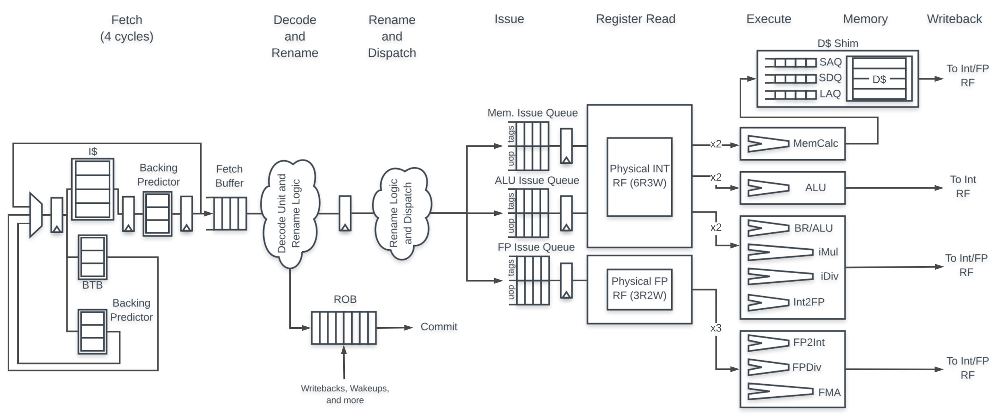
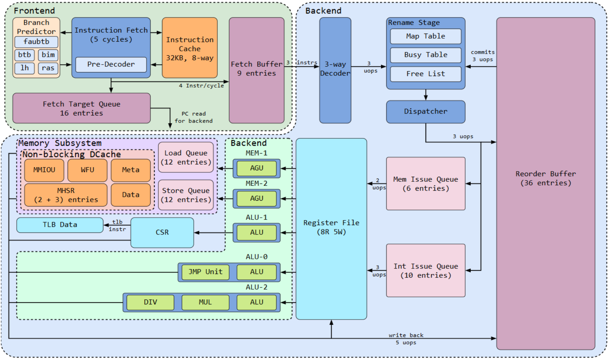

# 青科AI+创新工坊2024~2025学年第一次技术圆桌讨论会

## Transformer模型拓展与应用

### Transformer多模态实例

- CLIP: 使用对比学习（Contrastive Learning）方法，将大量的图文对（image-text pairs）作为训练数据。通过学习图像和文本在共同的嵌入空间中的表示，使得与特定文本描述相匹配的图像和文本对的嵌入向量更接近，而不匹配的则更远。
  


- VAE：与传统自编码器不同，VAE不仅学习数据的压缩表示（即潜在空间中的表示），还通过概率分布的方式对潜在空间进行建模。这样，VAE不仅可以将输入数据压缩为潜在变量，还可以从潜在空间中采样出新的数据。


- Diffusion：核心思想与扩散模型的生成过程类似，通过逐步加入噪声来破坏图像数据，然后通过学习反向去噪过程，将噪声图像还原为原始图像。这个过程包括两个主要阶段：

    - 前向扩散过程：将原始图像逐步转化为噪声图像。这个过程可以视为编码过程，其中噪声的引入相当于对图像信息的逐步隐藏或破坏。
    - 反向生成过程：从噪声图像开始，逐步去除噪声，最终还原出原始图像。这个过程对应解码过程，目的是从带噪声的表示中恢复出高质量的图像。


### Transformer性能优化

- 并行计算：Transformer模型的并行计算能力一直是研究热点。目前，Transformer模型的并行计算主要集中在两个方面：

    - 并行计算层：Transformer模型的并行计算层主要是指并行计算Transformer的各个层。目前，有两种并行计算方法：

        - 切分并行：将Transformer的各个层切分成多个子层，并行计算每个子层。
        - 层间并行：将Transformer的各个层并行计算。

    - 并行计算参数：Transformer模型的参数量非常大，因此并行计算参数也成为研究热点。目前，有两种并行计算方法：

        - 切分并行：将参数切分成多个子参数，并行计算每个子参数。
        - 层间并行：将参数并行计算。

    切分并行和层间并行的并行计算方法都可以有效提升模型的并行计算性能。

- 针对Attention的优化：
    

    - 注意力机制：Transformer模型的注意力机制是Transformer模型的核心。目前，有两种注意力机制：

        - 缩放点积注意力（Scaled Dot-Product Attention）：缩放点积注意力是Transformer模型的基础注意力机制。
        - 多头注意力（Multi-Head Attention）：多头注意力是一种改进的注意力机制，可以提升模型的表达能力。

    - 注意力层的优化：

        - 层内优化：在Transformer的各个层中，可以对注意力机制进行优化。目前，有两种优化方法：

            - 前向注意力优化：在每个注意力层的前向计算中，可以采用分组（group）机制，将注意力计算分解成多个组，并行计算每个组。
            - 后向注意力优化：在每个注意力层的后向计算中，可以采用分组（group）机制，将注意力计算分解成多个组，并行计算每个组。

        - 层间优化：在Transformer的各个层之间，可以对注意力机制进行优化。目前，有两种优化方法：

            - 跨层连接：在Transformer的各个层之间，可以采用跨层连接（cross-layer connections）机制，将不同层的注意力计算结果进行联合。
            - 层间注意力优化：在Transformer的各个层之间，可以采用层间注意力优化（layer-wise attention optimization）机制，将不同层的注意力计算结果进行联合。

    - 注意力算子的优化：
        - Flash Attention：一种新的针对GPU特性的注意力优化算子，可以提升模型的计算效率。
        - Paged Attention：对注意力的推理端进行优化，可节省显存与资源并仍然保持高效计算。

## 龙芯杯相关

### 简介

龙芯杯是一项专门为推动龙芯处理器及其生态系统发展而设立的全国性竞赛，旨在通过比赛形式，吸引更多的开发者、学生和研究人员参与龙芯平台的应用开发、优化和创新。这一竞赛为参赛者提供了一个展示和提升自己技能的平台，同时也促进了国产自主可控技术的发展。

除以下内容以外，请各位做好学习**数据结构**，**计算机组成原理**，**操作系统原理**与**汇编语言**的准备，最重要的是计算机组成原理。

我们的目标是，从零设计一个CPU，能够接近或达到今年复旦大学的性能指标，以角逐2025年龙芯杯**一等奖**。

### 数字电路与Verilog HDL

#### 1. **数字电路简介**
数字电路是以二进制（0和1）为基础的电子电路，广泛应用于计算机系统、通信设备等现代电子产品中。数字电路分为两大类：
- **组合逻辑电路**：输出完全由当前输入决定，不依赖于之前的状态。例如，加法器、多路复用器等。
- **时序逻辑电路**：输出不仅取决于当前输入，还与之前的状态有关。这类电路通常需要时钟信号进行同步，如触发器、寄存器和计数器等。

#### 2. **Verilog HDL简介**
Verilog HDL（Hardware Description Language）是一种广泛使用的硬件描述语言，用于描述和模拟数字电路的设计和行为。Verilog HDL不仅用于电路的行为描述，也可以用于结构级建模，最终通过综合工具实现为实际硬件。

Verilog代码通常用于两个层次的建模：
- **行为级建模**：描述电路功能的高级抽象。
- **结构级建模**：直接描述门级逻辑和电路的连接方式。


#### 3. **软件工具**
##### 3.1 **Verilator**
Verilator是一个开源的Verilog编译器，能够将Verilog代码编译为C++或SystemC代码，支持高效的仿真。与传统的仿真器不同，Verilator适用于复杂的系统级仿真，如完整的CPU功能仿真。它通常用于芯片设计中的验证工作，例如在[chiplab平台](https://gitee.com/loongson-edu/chiplab)上仿真CPU设计。


**特点**：
- 高效仿真大规模设计，如CPU、SoC。
- 支持生成C++或SystemC代码进行联合仿真。

**使用场景**：
- CPU设计的功能仿真与验证。
- 大规模数字系统的整体仿真。

##### 3.2 **ModelSim**
ModelSim是一款商业化的硬件描述语言仿真器，广泛用于Verilog和VHDL设计的验证工作。ModelSim能够执行精确的时序仿真，并支持复杂的测试平台（testbench），是验证设计正确性的主要工具。


**特点**：
- 支持精确的时序仿真。
- 提供图形化界面，便于调试和查看波形。

**使用场景**：
- 运行测试平台以验证设计逻辑。
- 进行时序分析，检测潜在的设计错误。

#### 4. **Verilog HDL示例代码**
以下是一个简单的2位全加器（Full Adder）的Verilog HDL实现及其测试平台：

**全加器模块：**

```verilog
module full_adder (
    input wire A,    // 输入A
    input wire B,    // 输入B
    input wire Cin,  // 进位输入
    output wire Sum, // 和
    output wire Cout // 进位输出
);
    assign Sum = A ^ B ^ Cin;  // 计算和
    assign Cout = (A & B) | (B & Cin) | (A & Cin);  // 计算进位
endmodule
```

**测试平台（Testbench）：**

```verilog
module tb_full_adder;
    reg A;
    reg B;
    reg Cin;
    wire Sum;
    wire Cout;

    // 实例化被测试模块
    full_adder uut (
        .A(A),
        .B(B),
        .Cin(Cin),
        .Sum(Sum),
        .Cout(Cout)
    );

    initial begin
        // 仿真输入
        $monitor("A=%b B=%b Cin=%b | Sum=%b Cout=%b", A, B, Cin, Sum, Cout);
        A = 0; B = 0; Cin = 0; #10;
        A = 0; B = 1; Cin = 0; #10;
        A = 1; B = 0; Cin = 1; #10;
        A = 1; B = 1; Cin = 1; #10;
        $stop;
    end
endmodule
```

#### 5. **参考资料与推荐书籍**
##### **参考资料**：
- **Verilator 官方文档**：[Verilator Documentation](https://www.veripool.org/wiki/verilator)
- **ModelSim 用户指南**：[ModelSim Documentation](https://www.mentor.com/products/fv/modelsim)

##### **推荐书籍**：
1. **《Verilog HDL数字系统设计》** 作者：Samir Palnitkar  
   这本书从基础到进阶，系统介绍了Verilog HDL的语法、建模方法和综合要点，适合初学者和有一定基础的读者。
   
2. **《数字逻辑与数字系统设计》** 作者：张旭  
   该书从基本的数字电路概念出发，逐步引入复杂的系统设计，涵盖了组合逻辑、时序逻辑和Verilog HDL的基本知识。

3. **《Verilog数字系统设计教程》** 作者：周东  
   这是一本以实践为导向的书，配有大量实例和习题，帮助读者理解并掌握Verilog HDL的实际应用。

这些资源将帮助你从基础入门，逐步掌握数字电路设计和Verilog HDL编程。

### 简单处理器处理器设计

龙芯杯中，我们所要做的，就是使用Verilog或类似的语言进行处理器设计。由于比赛所需要设计的CPU规模庞大，结构复杂，故再次先进行简单处理器设计。

**单周期处理器**是一种相对简单的CPU架构，在设计中每条指令都在一个时钟周期内完成。这种处理器的设计思想强调简洁性和易于理解，通常作为学习CPU设计的入门项目。单周期处理器的设计涵盖了计算机体系结构的核心概念，如指令集架构（ISA）、数据通路设计和控制逻辑实现。


而**五级流水线CPU**是处理器设计中的一种经典结构，也是单周期处理器的进阶，它将指令的执行过程分解为五个独立的阶段，使得每个阶段可以并行处理不同的指令。这种设计提高了CPU的指令吞吐量（Instruction Throughput），即在单位时间内可以执行更多的指令。

#### 1. **五级流水线的基本阶段**
五级流水线通常包括以下五个阶段：
1. **取指（Instruction Fetch, IF）**：从指令存储器中读取当前要执行的指令。
2. **译码（Instruction Decode, ID）**：对取出的指令进行译码，识别操作类型，并读取必要的寄存器。
3. **执行（Execution, EX）**：在算术逻辑单元（ALU）中执行算术或逻辑操作。
4. **存储（Memory Access, MEM）**：如果指令涉及数据存取，则在该阶段访问数据存储器。
5. **写回（Write Back, WB）**：将ALU的计算结果或从存储器读取的数据写回到寄存器。


#### 2. **流水线的优势**
- **提高指令吞吐量**：通过流水线技术，CPU能够在同一时间处理多条指令的不同阶段，从而提高了执行效率。
- **资源利用率提高**：流水线允许多个指令共享同一组硬件资源（如ALU），在不同的时钟周期中使用这些资源。


#### 3. **流水线的挑战**
- **数据冒险（Data Hazard）**：当指令间存在数据依赖性时，可能会导致流水线暂停，称为“气泡”。
- **控制冒险（Control Hazard）**：遇到分支指令时，CPU可能会取错指令，导致流水线的部分阶段需要清空和重新取指。
- **结构冒险（Structural Hazard）**：当多个流水线阶段同时访问同一资源时（如存储器），可能发生资源冲突。

#### 4. **解决方法**
- **数据转发（Data Forwarding）**：解决数据冒险的一种常见技术，通过直接将ALU的输出转发给需要它的下一个指令。
- **分支预测（Branch Prediction）**：减少控制冒险影响的一种方法，通过预测分支指令的执行路径来减少流水线清空的次数。
- **流水线暂停（Pipeline Stall）**：当无法避免冒险时，暂停流水线的一部分，使得前面的指令可以完成。


#### 5. **五级流水线CPU的Verilog HDL实现**
以下是一个简单的五级流水线CPU的顶层设计框架，这里仅展示了模块化的框架，并没有包括具体的控制逻辑和数据路径。

```verilog
module pipeline_cpu (
    input wire clk,
    input wire reset,
    output wire [31:0] pc_out, // 程序计数器输出
    output wire [31:0] alu_out // ALU输出
);

    // IF阶段 - 取指
    wire [31:0] instruction;
    wire [31:0] pc_next;

    fetch_stage IF_stage (
        .clk(clk),
        .reset(reset),
        .pc_next(pc_next),
        .instruction(instruction),
        .pc_out(pc_out)
    );

    // ID阶段 - 译码
    wire [31:0] reg_data1, reg_data2;
    wire [4:0] rs, rt, rd;
    wire [31:0] imm_value;

    decode_stage ID_stage (
        .clk(clk),
        .instruction(instruction),
        .reg_data1(reg_data1),
        .reg_data2(reg_data2),
        .rs(rs),
        .rt(rt),
        .rd(rd),
        .imm_value(imm_value)
    );

    // EX阶段 - 执行
    wire [31:0] alu_result;

    execute_stage EX_stage (
        .clk(clk),
        .reg_data1(reg_data1),
        .reg_data2(reg_data2),
        .imm_value(imm_value),
        .alu_result(alu_result)
    );

    // MEM阶段 - 存储访问
    wire [31:0] mem_data;

    memory_stage MEM_stage (
        .clk(clk),
        .alu_result(alu_result),
        .mem_data(mem_data)
    );

    // WB阶段 - 写回
    writeback_stage WB_stage (
        .clk(clk),
        .mem_data(mem_data),
        .alu_result(alu_result),
        .reg_data1(reg_data1),
        .alu_out(alu_out)
    );

endmodule
```

#### 6. **推荐书籍**
1. **《CPU设计实战——从架构到Verilog实现》** 作者：刘同山  
   这本书通过实战项目，带领读者从零开始设计一个简化版的CPU，适合学习五级流水线CPU设计的初学者。

2. **《计算机组成与设计：硬件/软件接口》** 作者：David A. Patterson, John L. Hennessy  
   这是学习计算机体系结构的经典教材，对五级流水线的设计有详细讲解，适合理论结合实践的学习。

3. **《数字逻辑与计算机设计》** 作者：Morris Mano  
   这本书涵盖了从基本数字逻辑到计算机系统设计的各个方面，其中包括流水线设计的基本概念。

4. **《深入理解计算机系统》** 作者：Randal E. Bryant, David R. O'Hallaron  
   该书详细介绍了从硬件到软件的各个层次，对理解CPU流水线设计和优化有很大帮助。

通过这些资源和实践，你将能掌握五级流水线CPU的设计原理，并能够实现一个功能完整的处理器模型。

### 超标量处理器设计

**超标量处理器**（Superscalar Processor）是一种可以在同一时钟周期内发射多条指令进行执行的处理器架构。与简单的流水线处理器相比，超标量处理器在并行性方面有更高的要求，需要更复杂的硬件设计来管理指令的并行执行、数据依赖性和控制流等问题。下面我们简要介绍超标量处理器设计中的几个关键方面。

#### 1. **缓存设计（Cache Design）**
缓存（Cache）在处理器中起着加速指令和数据访问的作用。超标量处理器通常使用以下几种缓存：
- **指令缓存（Instruction Cache, ICache）**：存储最近使用的指令，以减少从主存中取指令的延迟。超标量处理器需要高效的ICache来支持多个指令同时取出。
- **数据缓存（Data Cache, DCache）**：存储最近使用的数据，减少数据访问的延迟。DCache的设计需要支持多个加载/存储指令的并发执行。

#### 2. **二级翻译后备缓冲器（L2 TLB）**
L2 TLB是TLB层次结构中的第二层，它存储了更大范围的页表映射，以减少频繁的地址翻译开销。L2 TLB的设计必须考虑命中率、延迟和多端口访问，以适应超标量处理器的并行性需求。高效的L2 TLB可以显著降低页错误的开销，提升整体性能。

#### 3. **普通分支预测器（Branch Predictor）**
分支预测器用于减少分支指令引起的控制冒险。在超标量处理器中，分支预测器的性能对处理器的整体效率有很大影响。普通的分支预测器通常包括：
- **静态预测**：根据简单规则（如总是预测不跳转）进行预测，设计简单，但精度较低。
- **动态预测**：使用历史信息进行预测，如两位饱和计数器或全局历史寄存器，精度较高。

高效的分支预测器可以减少流水线冲刷（Pipeline Flush）的次数，提升处理器吞吐量。

#### 4. **带有ALU延迟的顺序双发（In-order Dual-Issue with ALU Delays）**
顺序双发（Dual-Issue）是超标量处理器中常见的技术，允许每个时钟周期发射两条指令执行。在顺序双发架构中，指令必须按程序顺序发射，通常会遇到以下挑战：
- **ALU延迟**：由于ALU操作可能需要多个时钟周期完成，因此处理器需要引入适当的调度机制来避免数据冒险。常见的做法是插入“气泡”或延迟其他指令的发射。
- **资源冲突**：双发设计需要处理资源共享问题，如两个指令同时需要ALU或访存资源时，如何调度和管理这些冲突是关键。

处理好这些问题可以有效提高处理器的指令发射率和整体性能。

### 5. **参考资料与推荐书籍**

#### **参考资料**
1. **《Computer Architecture: A Quantitative Approach》** by John L. Hennessy, David A. Patterson  
   这本书深入探讨了处理器架构的各个方面，包括超标量处理器、分支预测、缓存设计等，是了解超标量处理器设计的权威资料。
  
2. **《Understanding the Linux Virtual Memory Manager》** by Mel Gorman  
   这本书详细介绍了虚拟内存管理，包括TLB的工作原理和设计，适合学习L2 TLB相关内容。

#### **推荐中文书籍**
**《超标量CPU设计》** 作者：姚永斌  
   这本书介绍了超标量处理器的设计原理，并通过实例和实践的方式，带领读者设计一个超标量处理器，适合学习超标量处理器设计的初学者。

这些资源将帮助你更好地理解和掌握超标量处理器的设计原理及其实现方法。

### 与榜样对比，继续进步

复旦之CPU设计结构如下，他们参考了BOOM。

BOOM是一个乱序四取指四发射十级流水线的处理器，其结构如下：




复旦大学团队对此进行了更细致的打造，其结构如下：



#### 他们的待改进之处

微架构中存在的问题：
- 处理器出于频率考虑具有较深的流水线，分支恢复代价较高。
- ICache设计为3级流水，单周期的分支预测器并不适配。
- 集中式发射队列选择逻辑复杂，占用大量资源且影响时序。
- 采用发射后读寄存器的方式，指令从发射到执行存在2周期的间隔。
- load-use指令之间存在4周期的间隔，往往会导致阻塞。
- 5条后端流水线导致寄存器堆需要提供大量读口。
- 指令集规定TLB组织方式为32路全相联导致地址翻译时间过长。

#### 前端 - 混合分支预测

优化方案：
- 采用混合分支预测器，当发现更晚的预测与更早的预测不符时，前端内部进行重定向，这使得分支预测器能够加入更复杂的多周期预测器。
- 为每条指令赋予一个Branch Tag，跨分支指令时Branch Tag改变。

混合分支预测器能够很好的实现频率与分支预测准确率的平衡，并且能够适配3周期的指令缓存。这样能够在发现分支预测错误时及时清除错误指令并重新取指，而无需等到分支指令提交后再进行重定向。

#### 后端 - 异步访存子系统

前端（Front End）是处理器的第一层，负责指令的解码、指令缓存、指令调度等。复旦团队在前端中加入了指令缓存，以减少指令的取出延迟。

在他们的设计中，做了如下处理：

- Load指令乱序执行，Store指令严格按序执行，Load指令与Store指令之间乱序执行。

- 2条访存执行流水线，可以同时执行至多2个访存请求。

- 利用AXI的id特性，允许多个AXI请求并行在Slave端执行。

- 非阻塞数据缓存，尽可能提高乱序执行能力，隐藏缓存缺失带来的阻塞。

#### 后端 - 整数发射队列子系统


后端（Back End）是处理器的最后一层，负责执行指令、数据缓存、寄存器堆、ALU等。复旦团队在后端中加入了整数发射队列，以提高整数运算的并行度。

优化方案：
- 为整数发射队列添加发射掩码，只有位于特定位置的指令能够被发射到整数单元中执行。
- 添加快速唤醒机制，在指令发射时，若其结果可被转发，则直接唤醒其后继指令。

实验表明，并非每个发射槽中的指令都能发射，为了降低选择电路的规模，引入了发射掩码，只有掩码为1的指令才能发射。
在实现中，将整数发射队列中30组请求（共计10项发射槽，3个整数单元）降低至21组，在保持IPC几乎不变的情况下，有效简化了发射逻辑。

而添加推测唤醒机制后，当Load指令被LSU选中发送到数据缓存时，直接唤醒其后继指令，若发生缓存缺失，则通知发射队列取消唤醒。

#### 后端 - 微指令编码子系统


微指令（Micro-Instruction）是一种特殊的指令，它可以包含多个基本指令，并在执行时被分解为基本指令。复旦团队在后端中加入了微指令编码子系统，以提高指令的并行度。

优化方案：
- 将Store类指令拆分为STA和STD两个uop。
- 将访存单元寄存器读端口数目减小为1。

实验表明，Store类指令需要的2个操作数往往不能够同时就绪。
拆分后，Store类指令的发射更加灵活，需要的操作数也减少至1个。
寄存器堆读端口数目从10减少至8，有效降低资源的使用。

#### 后端 - L0/L2 TLB

优化方案：
- 引入对体系结构隐藏的2级TLB设计。实现L0-iTLB、L0-dTLB、TLBData。
  
基于局部性，0级TLB被设计为只包含2个TLB项，极大简化查找逻辑。

对于0级TLB缺失，抛出自定义异常并触发0级TLB重填。

为TLBData读端口引入仲裁机制，一周期至多接收一个查询请求并配置优先级，减少不必要的重填带来的抖动。

#### 本人CPU设计架构与缺陷

本人设计的CPU，为单访存顺序双发射六级流水线：

1. IF1：接入分支预测并预取（虽实际上因为各种BUG未真正实现）
2. IF2：接入d-cache并取指令
3. ID：单发译码并发出微指令，并设置延迟，放入指令队列
4. EXE1：执行微指令，并进行乘除法计算
5. EXE2：大体同EXE1，但其ALU为延后设计，以适应顺序执行
6. WB：为传统MEM与WB之合并，将数据写回寄存器堆，并异步执行访存，更新分支预测。

本人CPU之运行逻辑：
1. 单取指，单编码，编码后延迟，以适应顺序双发射。
2. ALU延迟设计，可将前一个计算结果用至后面一条指令。
> 例子：
> ```c
> a = b + c;
> d = a + e;
> ```
> 此处的a b c d e均为寄存器。此时，若第一个流水线计算前一个语句，第二个流水线计算后一个语句，则会出现数据依赖问题。此时，我们让前面先运行，运行完后面再跟上，这时由于a就等于b+c，所以可以直接用b+c的结果，带入到下面继续+e，而不用等到后面再计算。
3. 若出现第一个流水线的指令对第二个具有依赖，则出现数据shift，也就是两者互换。
4. 若出现第二条流水线的指令准备进行乘除法计算，则等待第一条流水线指令的EXE1执行完，然后将其放入第一个流水线乘除法器进行计算，第二条流水线负责等待。


本人CPU之缺陷：
1. 指令缓存未实现，指令缓存的作用是减少指令的取出延迟，但实际上由于各种BUG未实现。
2. 指令调度未实现，指令调度的作用是保证指令的顺序执行，但实际上由于各种BUG未实现。
3. 乘除法计算仅放在第一条流水线，第二条流水线空闲，导致流水线不饱和，等待时间拉长。
4. 未实现复旦大学团队之诸多优化方案。
